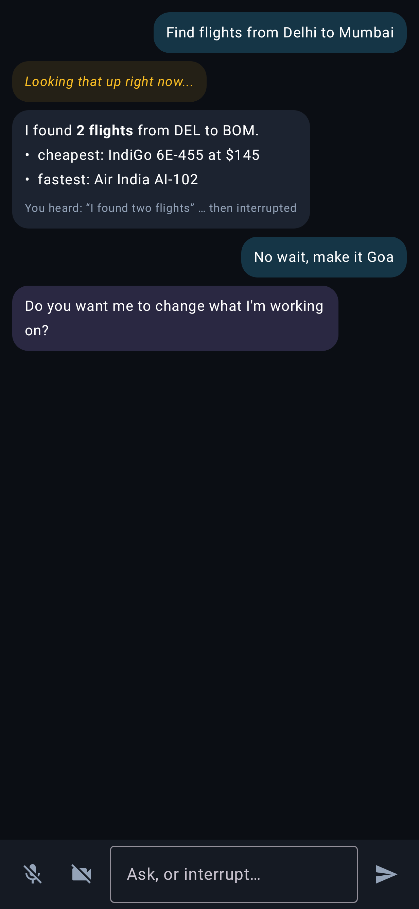
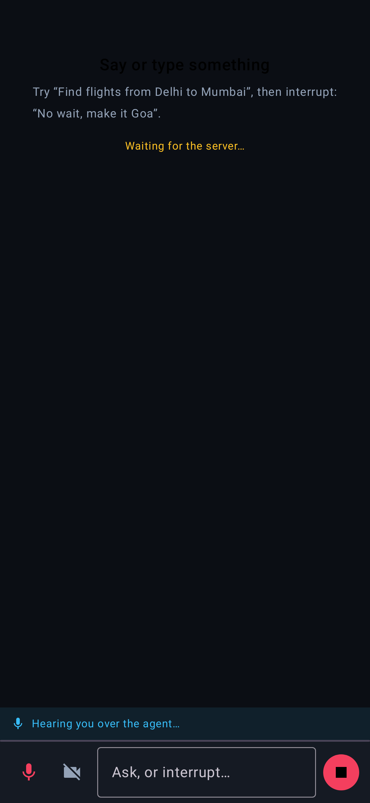
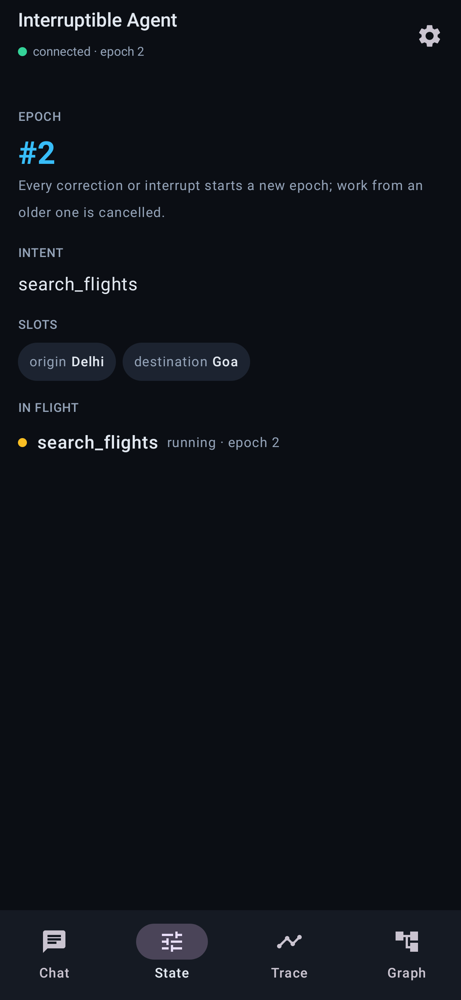
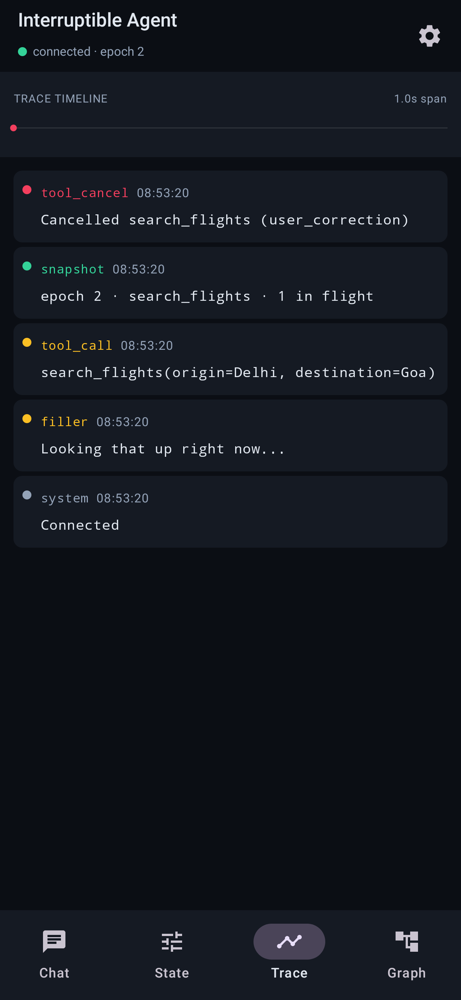
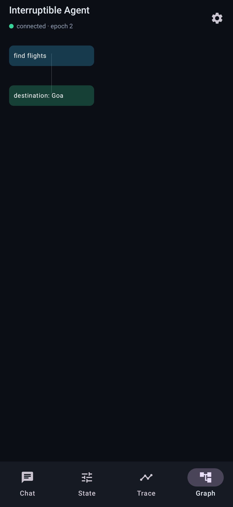
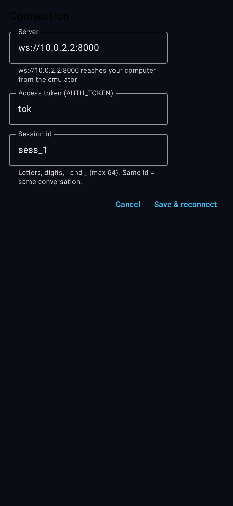

# Kairos · Καιρός — Android app

A native Kotlin / Jetpack Compose client for the interruptible-agent server. It does what the web console does: chat, hands-free
voice with barge-in, spoken replies you can talk over, camera sharing for the vision tool, and the agent's own view of the
session (epoch, slots, in-flight calls, trace timeline, cognitive graph). The agent itself runs on the server; the app is a thin
client over the same WebSocket protocol (`/ws/{session_id}`).

| Chat | Barge-in | State |
|---|---|---|
|  |  |  |

| Trace | Graph | Settings |
|---|---|---|
|  |  |  |

(Screenshots are rendered by the Compose UI tests, not hand-made: `app/build/screenshots/` after `testDebugUnitTest`.)

## Build and run

Android Studio (Koala or newer): open the `android/` folder and run `app`. Or, with only Docker installed:

```bash
docker build -f android/Dockerfile.build -t iagent-android-build android/
docker run --rm -v "$PWD/android:/workspace" -v iagent-gradle:/root/.gradle iagent-android-build \
    ./gradlew testDebugUnitTest assembleDebug
# APK: android/app/build/outputs/apk/debug/app-debug.apk   (adb install -r ...)
```

The build image accepts the Android SDK licenses (`sdkmanager --licenses`), the same agreement Android Studio asks for.

Start the backend (`docker compose up`, or `uvicorn agent.server:app --host 0.0.0.0 --port 8000`). In the **emulator** the default
address `ws://10.0.2.2:8000` already reaches your computer. On a **phone** open Settings and enter `ws://<your-computer-LAN-ip>:8000`
(or `wss://your.domain` with the Caddy profile). If the server sets `AUTH_TOKEN`, paste it into Settings; a refused connection is
shown in the app bar and is not retried until you change the settings.

## How it works

```
data/Protocol.kt     server messages -> typed AgentAction; client frames (Outgoing). Tolerant: unknown actions never crash.
data/Transport.kt    OkHttp WebSocket: reconnect with backoff, 401/403/1008 = "refused" (no retry), answers server-initiated close.
state/ChatReducer    (state, message) -> state, pure. Voice bubbles, truncation notes, graph merge, trace, epoch high-water mark.
state/AgentController  glue + the full-duplex rules; the network, speaker and mic are injected interfaces, so it is unit-tested.
audio/Audio.kt       AudioRecord (VOICE_COMMUNICATION + AEC/NS/AGC) -> 100 ms PCM frames; AudioTrack for replies.
camera/FrameSampler  CameraX analysis -> <=1 JPEG/s, <=1024 px (the server only runs vision when a question needs it).
ui/                  Compose: chat, state, trace (timeline + log), graph (layered layout), settings.
```

Full duplex on the device:
- **Mic** is captured as `VOICE_COMMUNICATION` in `MODE_IN_COMMUNICATION` with the platform echo canceller, noise suppressor and AGC attached,
  and **replies play through an `AudioTrack` declared `USAGE_VOICE_COMMUNICATION`**, which is what gives the echo canceller its reference
  signal. The server adds its own echo guard on top.
- `speech_state: ducked` lowers the volume immediately (you started talking); `stopped` flushes the audio queue at once. Typing or pressing
  Stop flushes locally without waiting for the round trip. A cut-off reply is annotated in the chat: *You heard: “…” then interrupted*.
- After a reconnect the app re-announces what it wants (spoken replies, hands-free) because the server keeps no per-connection preferences.

## Tests (125 JVM tests, no emulator or device needed)

`./gradlew testDebugUnitTest` runs:

- **Protocol** against fixtures generated by the *real* server classes (`python scripts/dump_android_fixtures.py`). If the server's schema
  changes, `tests/test_android_fixtures.py` (server side) fails until the fixtures and the Kotlin models are updated together. The same
  test replays every frame the app sends (`client_frames.json`) against the real server.
- **Reducer / controller** (fakes for network, speaker, mic): voice bubbles, truncation, duck/flush, reconnect re-announce, camera gating...
- **Transport** against a real WebSocket server (MockWebServer): reconnect after close, a downed server, 403 and 1008 not retried.
  It caught a real bug: a client that does not answer a server-initiated close stays "connected" on a dead socket.
- **Compose UI** under Robolectric: real composables rendered, clicked and screenshotted.
- **Live server** (`LiveServerTest`, skipped unless `AGENT_SERVER_URL` is set): the real client code against a running server — a typed
  request, spoken audio delivery, typing over the agent's voice, and real speech streamed as 100 ms frames being transcribed:
  `docker run --network host -e AGENT_SERVER_URL=ws://127.0.0.1:8000 ... ./gradlew testDebugUnitTest --tests '*LiveServerTest'`.

## Not done / not verified

- **Never run on a device or emulator.** This machine has no KVM, so everything above is JVM-level. What that does not cover: how the
  platform echo canceller behaves on your phone (device-dependent), real microphone/camera permission flows, CameraX on hardware, and
  AudioTrack latency. Treat the first run on a phone as the real test.
- Opening the Settings *dialog window* is not UI-tested (Robolectric cannot settle on a Compose `Dialog`); the form inside it and the save path are.
- Hands-free listening stops when the app is backgrounded (no foreground service). Camera only; screen sharing needs MediaProjection.
- Debug-signed APK only; release builds are minified but unsigned. Cleartext `ws://` is allowed for LAN/dev (the Settings screen warns for
  non-local plaintext addresses) — use `wss://` beyond your own network.
- Dependency versions are a known-compatible set (AGP 8.5, Kotlin 2.0.20, Compose BOM 2024.09); lint reports newer versions exist.
