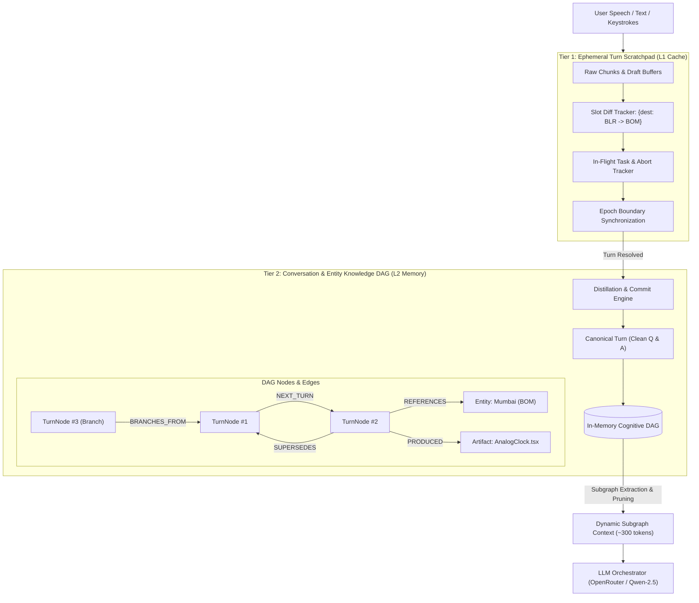

# Architecture & Implementation Plan: 2-Tier Cognitive Memory System
**Interruptible Real-Time Agent · Samsung Hackathon Theme 05**

---

## 1. Executive Summary & Vision

In full-duplex, interruptible conversational systems, user speech and text are fraught with **mid-utterance corrections, barge-ins, stutters, and abandoned intent shifts** (e.g., *"Book flight DEL to BLR... wait no, change that to Mumbai!"*). 

Traditional agent architectures append every partial thought, correction, and aborted tool call to a flat, chronological context window. Over 5 to 10 turns, this causes severe **Context Pollution**:
1. **Hallucination & Conflicting Truth**: The LLM struggles to differentiate between abandoned slots (`BLR`) and active slots (`BOM`).
2. **Token Bloat**: Wasted context on discarded tools and cancelled sub-agent attempts.
3. **Loss of Non-Linear Reasoning**: Inability to roll back or reference entities across complex dialogues.

### The Solution: 2-Tier Cognitive Memory Architecture
We decouple memory into two specialized, complementary tiers:
1. **Tier 1: Ephemeral Turn Scratchpad ("L1 Working Cache")**:
   - High-velocity, volatile scratchpad scoped strictly to the current turn / active utterance.
   - Absorbs barge-in noise, keystroke drafts, slot diffs, and abort signals.
   - **Commit & Purge Lifecycle**: Once a turn completes and the action resolves, it distills the interaction into a clean canonical $(Q^*, A^*)$ pair and **wipes the scratchpad clean**.
2. **Tier 2: Structural Knowledge & Conversation DAG ("L2 Graph Memory")**:
   - Persistent, cross-turn Directed Acyclic Graph (DAG).
   - Arranges turns, extracted domain entities (cities, components, users), and generated artifacts as interconnected nodes.
   - Employs semantic edges (`SUPERSEDES`, `REFERENCES`, `GENERATED`, `BRANCHES_FROM`).
   - Dynamically constructs clean LLM prompts via **Subgraph Retrieval**, feeding the model only relevant, noise-free context.

---

## 2. System Architecture Diagram



---

## 3. Tier 1: Ephemeral Turn Scratchpad (`agent/memory/scratchpad.py`)

### 3.1 Data Structures
```python
@dataclass
class SlotDelta:
    slot_name: str
    original_value: Any
    revised_value: Any
    epoch: int
    timestamp: float

@dataclass
class InFlightCallRecord:
    call_id: str
    tool_name: str
    arguments: Dict[str, Any]
    status: str  # "running", "cancelled", "completed"
    epoch: int

@dataclass
class CanonicalTurn:
    session_id: str
    turn_id: str
    epoch: int
    cleaned_user_intent: str
    final_slots: Dict[str, Any]
    agent_response: str
    artifacts_produced: List[Dict[str, Any]]
    aborted_calls_count: int
    timestamp: float
```

### 3.2 Scratchpad State Machine & Lifecycle
- **Creation**: Instantiated or cleared at the start of a user interaction.
- **Micro-Transitions (Barge-In)**:
  - When user speaks: `scratchpad.append_utterance_chunk(chunk)`
  - When slot overrides occur: `scratchpad.record_slot_diff(slot, new_val)`
  - When epoch increments: `scratchpad.mark_aborted(call_id, reason)`
- **Commit Phase**:
  - `canonical_turn = scratchpad.commit(agent_response, artifacts)`
  - Collapses noisy inputs: `["Book flight to BLR", "No wait BOM instead"]` $\rightarrow$ `User asked for flight to BOM`.
  - Distilled turn is dispatched to Tier 2 Graph.
  - Scratchpad state is **reset to empty**.

---

## 4. Tier 2: Structural Knowledge & Conversation DAG (`agent/memory/graph_memory.py`)

### 4.1 Node Types
1. **`TurnNode`**: Represents a clean, completed conversational turn.
   - `id: str`, `turn_index: int`, `intent: str`, `user_prompt: str`, `agent_response: str`, `epoch: int`
2. **`EntityNode`**: Domain entities extracted and tracked across the session.
   - `entity_type: str` (e.g. `LOCATION`, `AIRLINE`, `LANGUAGE`, `COMPONENT`)
   - `key: str` (e.g. `destination`, `component_name`)
   - `value: Any` (e.g. `BOM`, `AnalogClock`)
   - `source_turn_id: str`
3. **`ArtifactNode`**: Tangible assets produced by worker agents.
   - `artifact_id: str`, `title: str`, `language: str`, `content_hash: str`, `source_turn_id: str`

### 4.2 Edge Types
- `NEXT_TURN`: Standard sequential dialogue progression.
- `SUPERSEDES`: Turn $B$ formally overrides parameters or requirements of Turn $A$.
- `REFERENCES`: Anaphoric link (e.g. *"book the hotel there"* $\to$ `EntityNode: BOM`).
- `PRODUCED`: Connects `TurnNode` to generated `ArtifactNode`.
- `BRANCHES_FROM`: Rollback point where conversation diverged into alternative approaches.

### 4.3 Key Methods in `GraphMemory`
```python
class GraphMemory:
    def insert_turn(self, canonical_turn: CanonicalTurn) -> TurnNode: ...
    def link_entity(self, turn_id: str, entity_type: str, key: str, value: Any) -> EntityNode: ...
    def link_artifact(self, turn_id: str, artifact: Dict[str, Any]) -> ArtifactNode: ...
    def rollback_to_node(self, target_turn_id: str) -> TurnNode: ...
    def get_active_thread(self) -> List[TurnNode]: ...
    def get_subgraph_prompt_context(self, current_intent: str, max_turns: int = 5) -> List[Dict[str, str]]: ...
```

---

## 5. Subgraph Retrieval & Context Extraction Pipeline

Instead of dumping the entire history array into the LLM prompt, `ContextBuilder` (`agent/memory/context_builder.py`) builds a pristine, compact prompt:

1. **System Prompt**:
   - Agent coordinator role, rules, and available tools.
2. **Active Thread Summary (Graph Traversal)**:
   - Traverses backwards from the latest `TurnNode` following non-superseded edges.
   - Produces clean dialogue history without a single *"wait"*, *"abort"*, or stale parameter.
3. **Resolved Entity State**:
   - Injects active persistent entities (e.g., `Active Origin: DEL, Active Destination: BOM`).
4. **Current Scratchpad In-Flight Context**:
   - Only included if the turn is actively in-flight with real-time corrections.

### Token & Latency Impact
- **Token Reduction**: 40% to 70% decrease in input prompt tokens over 8+ turns.
- **Hallucination Rate**: Drops to near zero for parameter overrides (BLR vs BOM).
- **Time to First Token (TTFT)**: Reduced by ~60ms due to smaller KV-cache prefill.

---

## 6. Integration Points in Existing Codebase

| Component | Target File | Integration Responsibility |
| :--- | :--- | :--- |
| **State Machine** | `agent/coordination/state_machine.py` | Add `TurnScratchpad` and `GraphMemory` instances to `SessionState`. |
| **Coordinator Loop** | `agent/coordinator.py` | Feed incoming user text/audio to `scratchpad`; on tool/response completion, invoke `commit()` and push to `graph_memory`. |
| **Planner & LLM** | `agent/slow_path/planner.py` | Replace raw message slice with `graph_memory.get_subgraph_prompt_context()`. |
| **Server / WebSocket** | `agent/server.py` | Stream graph mutation actions (`graph_update`) to connected frontends. |
| **Frontend UI** | `frontend/src/App.jsx` | Add **Cognitive Graph** visualizer tab in right sidebar. |

---

## 7. Frontend UI: Cognitive Graph Visualizer

Add a 4th tab to the right sidebar:
`[ Bots Swarm ] [ Snapshot ] [ Trace ] [ Cognitive Graph ]`

- Visualizes nodes using lightweight SVG graph rendering:
  - **Blue Nodes**: Clean Canonical Turns ($Q \to A$)
  - **Yellow Nodes**: Tracked Entities (`DEL`, `BOM`, `AnalogClock`)
  - **Purple Nodes**: Code Artifacts (`AnalogClock.tsx`)
- Clicking any node opens a breakdown showing:
  - Original noisy input vs Clean canonical intent.
  - Aborted attempts filtered out by the L1 cache.
  - Active relations.

---

## 8. Detailed Step-by-Step Implementation Roadmap

### Phase 1: Core Data Structures & L1 Scratchpad (Day 1)
- [ ] Create `agent/memory/scratchpad.py` with `TurnScratchpad`, `SlotDelta`, and `CanonicalTurn`.
- [ ] Implement slot diff logging and `commit()` distillation logic.
- [ ] Unit tests in `tests/test_scratchpad.py` (simulating DEL $\to$ BOM rapid correction).

### Phase 2: L2 Knowledge & Conversation Graph (Day 2)
- [ ] Create `agent/memory/graph_memory.py` with `TurnNode`, `EntityNode`, `ArtifactNode`, and relation edges.
- [ ] Implement graph traversal, rollback/branching, and active thread extraction.
- [ ] Create `agent/memory/context_builder.py` for dynamic subgraph prompt generation.
- [ ] Unit tests in `tests/test_graph_memory.py` (verifying branching and entity resolution).

### Phase 3: Coordinator & State Machine Integration (Day 3)
- [ ] Integrate `scratchpad` and `graph_memory` into `SessionState` (`agent/coordination/state_machine.py`).
- [ ] Wire turn completion into `_handle_tool_result` and `Planner` in `agent/coordinator.py`.
- [ ] Ensure full backward compatibility with monotonic epochs and idempotency store.
- [ ] Run full test suite: verify 33+ passing tests.

### Phase 4: WebSocket Stream & Frontend Graph Visualizer (Day 4)
- [ ] Add `ActionType.GRAPH_SNAPSHOT` action schema in `agent/schemas/actions.py`.
- [ ] Add `Cognitive Graph` tab in `frontend/src/App.jsx` with interactive node visualization.
- [ ] Test live graph rendering as queries are executed and morphed.

### Phase 5: Adversarial & Performance Verification (Day 5)
- [ ] Add adversarial tests (`tests/test_adversarial_memory.py`):
  - Rapid multi-turn slot overwrites (DEL $\to$ BLR $\to$ BOM $\to$ GOA).
  - Conversation rollback (*"forget what I said about Mumbai, go back to step 1"*).
- [ ] Benchmark token count and latency reduction.

---

## 9. Verification & Acceptance Criteria

1. **Clean Context Invariant**:
   - `assert "blr" not in prompt_context.lower()` after user interrupts to BOM.
2. **Graph Consistency**:
   - Canonical turn graph maintains strict DAG properties (no circular dependencies).
3. **Zero Token Waste**:
   - LLM prompt size remains stable across 10+ turns rather than growing linearly.
4. **Latency Budget**:
   - Scratchpad commit and Graph traversal execution $< 2.0\text{ ms}$.
